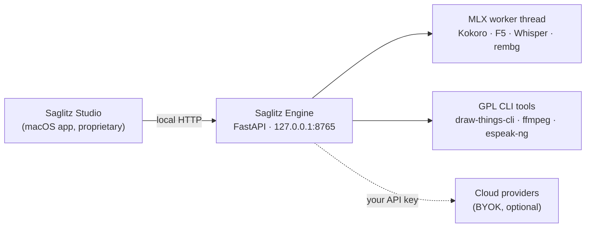

<div align="center">

# Saglitz Engine

**The open-source generative media engine behind Saglitz Studio.**

A self-contained, local-first inference server for image, persona, video, and audio generation on Apple Silicon. Runs entirely on your Mac, with optional bring-your-own-key cloud providers for the heavy jobs.

[](LICENSE)
-black.svg)


</div>

---

## What this is

Saglitz Engine is the local HTTP service that does the actual generative work for **Saglitz Studio**, a native macOS app for photographers, marketers, and creators. The engine is fully open source under the GPL-3.0. The app that drives it is a separate, proprietary product.

This repository is both:

- **The source** of the engine (browse `engine/`), and
- **The distribution host** for the prebuilt, self-contained bundle the app downloads on first launch (see [Releases](../../releases)).

Everything runs on `127.0.0.1`. No telemetry, no account, no data leaves your machine unless *you* enable a cloud provider with your own API key.

## Why it is split this way (open-core)

| Layer | License | Where |
|-------|---------|-------|
| **Engine** (this repo) | **GPL-3.0** | Open source, public |
| **Saglitz Studio** (the macOS app) | Proprietary | Sold separately |

The engine *must* be open: it loads GPL-licensed text-to-speech (`piper`, `phonemizer` via Kokoro) in-process and bundles GPL command-line tools (`draw-things-cli`, `ffmpeg`, `espeak-ng`). The macOS app talks to the engine **over local HTTP as a separate process**. That is aggregation, not linking, so the app is not a derivative work and remains proprietary. There is **no AGPL** anywhere in the stack.

In short: the engine is yours to study, modify, and reuse under the GPL. The app's interface, brand, persona system, and workflow are not part of this repository.

## Capabilities

The engine exposes a single FastAPI surface (~50 endpoints) covering four studios:

### 🖼️ Image
- Local diffusion via `draw-things-cli` (FLUX, SDXL, SD 1.5 families) and MLX (`mflux`)
- Text-to-image, image-to-image, inpaint, outpaint, region replace
- Real upscaling (Lanczos) and true 4K via hi-res-fix
- Background removal, Civitai model and LoRA search / download / import
- LoRA training (Dreambooth-style) with architecture-aware matching

### 🧑 Persona
- Consistent character generation built on FLUX.2 Klein 4B (Apache-2.0, commercial-safe) for photoreal output without a LoRA
- Trained-LoRA personas, watermarking, content-pack export

### 🎬 Video
- Local and cloud (BYOK) text/image-to-video
- Combine, reframe, Ken Burns, voiceover, auto-subtitles, upscaling
- Timeline sequencing with project-relative media

### 🔊 Audio
- Text-to-speech via Kokoro and Piper (downloadable voice catalog)
- Voice cloning (F5), transcription (Whisper), word-level editing
- Sound effects, dialogue, and music beds

> Cloud jobs are optional and key-gated. Outbound calls are restricted by host allowlists (`fal.run` / `fal.ai` / `fal.media`, `civitai.com`) with bearer-token stripping across redirects.

## Architecture



Design notes that matter for running this on a personal machine:

- **Bounded memory.** Resident models live in an LRU cache (default: 1 model). An idle reaper frees everything after 10 minutes of inactivity, so the engine does not quietly accumulate gigabytes of RAM.
- **All subprocesses are timeout-bounded** and invoked with list arguments (never a shell), so a stuck job cannot wedge the server and there is no command-injection surface.
- **All file access is path-confined** to the project and media directories; history and manifests are written atomically under a lock.
- **MLX work is pinned to a single worker thread** to keep Metal state consistent.

## The self-contained bundle

End users never install Python. The app downloads one tarball on first run and verifies it against a SHA-256 pinned into the app. The bundle contains:

- Portable CPython 3.11 (from [python-build-standalone](https://github.com/astral-sh/python-build-standalone))
- The full ML stack as a frozen venv (`engine/requirements.lock.txt`)
- The engine source (this repo's `engine/`)
- The three GPL CLI tools, with dylibs rewritten to `@executable_path` so they relocate cleanly
- The complete GPL/LGPL license texts and a `SOURCES.txt` source offer

Built reproducibly by [`build-engine-bundle.sh`](build-engine-bundle.sh).

## Build from source

```bash
# 1. Run the engine directly (dev)
python3 -m venv .venv && source .venv/bin/activate
pip install -r engine/requirements.lock.txt
uvicorn server:app --app-dir engine --host 127.0.0.1 --port 8765

# 2. Or build the distributable, self-contained bundle
./build-engine-bundle.sh
```

The launcher [`start-engine.sh`](start-engine.sh) sets `PATH` and `ESPEAK_DATA_PATH` and starts uvicorn with the bundle as its working directory.

## Licensing

This engine is licensed under the **GNU General Public License v3.0**. See [LICENSE](LICENSE).

Bundled third-party components and their licenses:

| Component | License | Role |
|-----------|---------|------|
| `draw-things-cli` | GPL-3.0 | Local diffusion |
| FFmpeg | GPL-3.0 (as built) | Video / audio processing |
| eSpeak NG | GPL-3.0 | Phonemization backend |
| Piper | GPL-3.0 | Text-to-speech |
| phonemizer (via Kokoro) | GPL-3.0 | Phonemization |
| num2words, frozendict | LGPL | Helpers (GPL-compatible) |
| sentencepiece, MLX, FastAPI, … | Permissive (Apache/MIT/BSD) | Stack |

Complete license texts ship inside every release bundle. If you redistribute a bundle, you are redistributing GPL software and must honor the GPL, including the source offer in `SOURCES.txt`.

## Screenshots

Screenshots of Saglitz Studio, the app this engine powers, are coming soon.

---

<div align="center">
<sub>Saglitz Engine is free software under the GPL-3.0. The Saglitz Studio app is a separate proprietary product.</sub>
</div>
